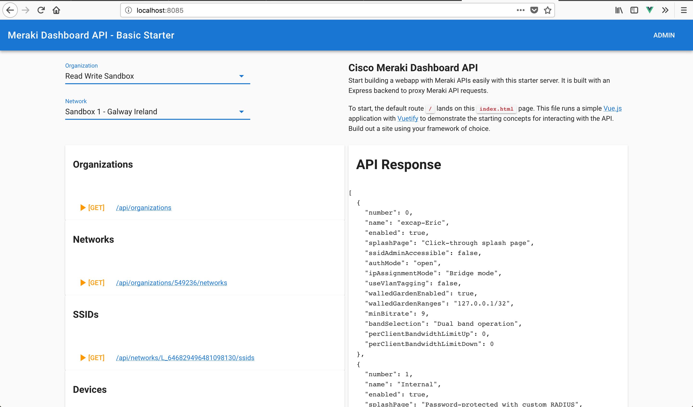

# Express Server
* Meraki API Request Handler
* Vue.JS sample static HTML page

## Overview
This application provides two core functions, host a website and provide a proxy to the Meraki API.

`public` directory will host any HTML files and supporting assets. A sample **Vue JS** application was written in a single HTML file for demo purposes. Use your own front end framework of choice or build out a professional Vue application.

`server.js` file runs the **express** web server. It proxies the Meraki API requests so that a client browser can interact with the Dashboard API. Doing this directly will result in cross site scripting errors (CORS). 

`meraki-request` file is a request wrapper that follows the Meraki API redirects properly. 

`configs.js` file stores the API key used by the server. Used as the default API key unless specified by client.

## Install
- Clone this repository and change into the directory, 
- Update your API key in the `configs.js` file.
- Install dependencies and run the server.

```
$ npm install
$ node server.js

WWW Server: http://::8085/
Meraki API Client Proxy: http://:::8085/api
Meraki API Endpoint:  https://api.meraki.com/api/v0
```

## Usage
### Home Page
http://localhost:8085/

### Meraki API Requests
http://localhost:8085/api

*http://localhost:8085/api/organizations*


## Demo

### Live Demo on Heroku
https://meraki-dashboard-api-express.herokuapp.com/

The Vue application demonstrates how to access the Meraki API endpoints. 

Update the **API key** in the **Admin** menu to get started

You typically need to first call the organizations endpoint and then pull the network list before most calls can be made. This demo provides a selector to define these variables, to then be used in a few API requests. 

Each endpoint has a button to display the API responses. 

By clicking on the API links provided, you can use the server defined API key as a standalone proxy. You will need to add your own headers to adjust the API key or it will use the defaults.




